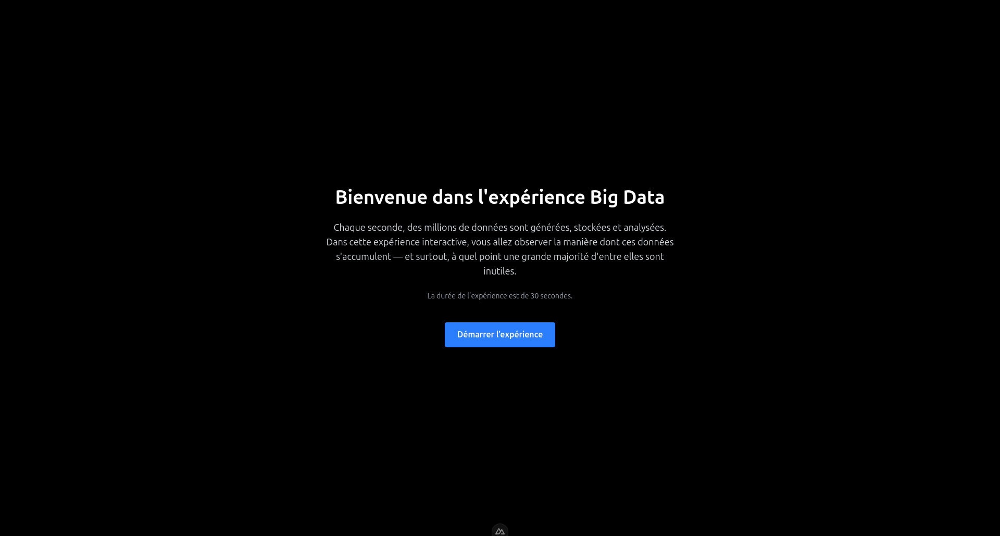
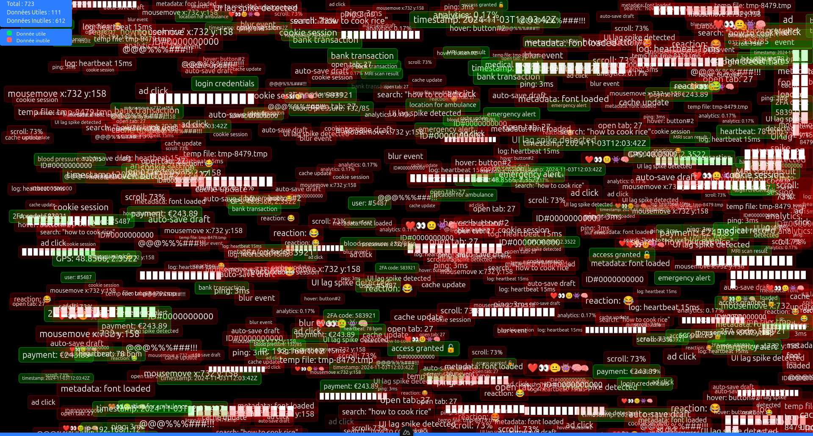
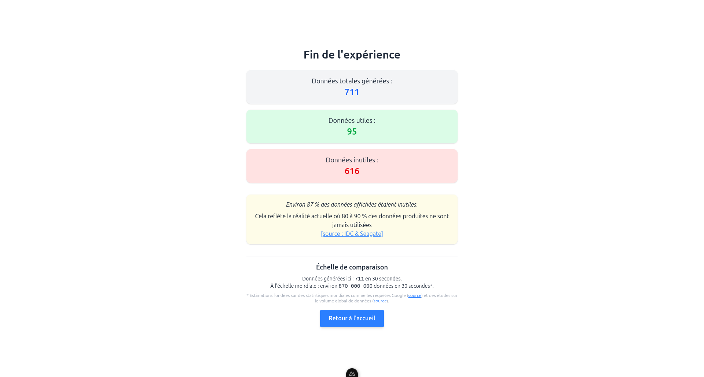

# **Surcharge Silencieuse**  
2025 Romain Rodrigues

---

# Visuels

---

# Texte

**Surcharge Silencieuse** est une expérience numérique immersive qui explore la surproduction massive de données dans notre société contemporaine.  
Sur un fond sombre, des blocs de données — certains essentiels, d’autres totalement insignifiants — apparaissent à un rythme de plus en plus rapide, saturant progressivement l’écran.

L'œuvre souligne la disproportion flagrante entre l'information utile et l'information inutile : la majorité des données produites ne sert à rien, noyant ainsi les éléments essentiels dans un flux incohérent.  
À l'issue de l'expérience, un résumé statistique vient révéler ce déséquilibre, mettant en évidence l'infime part de données véritablement pertinentes face à la masse écrasante d'informations superflues.

**Surcharge Silencieuse** a été réalisé en 2025 dans le cadre d'une réflexion critique sur le Big Data et ses effets invisibles sur notre perception du monde numérique.

---
